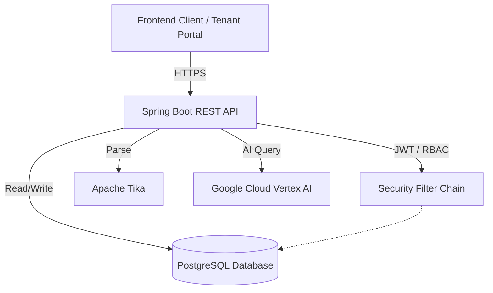

# SecureDocAI Platform (Backend)

SecureDocAI is a robust, general-purpose AI Tooling Platform (White-label SaaS) designed to empower various businesses—including telehealth providers, law firms, and tax professionals—to build secure, AI-enhanced portals. Crucially, this platform will eventually serve as tooling for other professions in the exact same way that the "doctor genetics sales" model works.

This repository contains the backend application that powers the white-label B2B2C infrastructure. It provides the essential services and APIs for professionals to manage their practice, and for their clients to securely interact with AI-driven workflows and document management.

## 🏗️ Architecture & Data Flow



## 🔐 Multi-Tenancy Strategy
As a white-label infrastructure platform, data isolation is critical. Currently, SecureDocAI utilizes **Row-Level Security / Logical Data Isolation** within PostgreSQL. Every entity is strictly associated with its respective user/tenant hierarchy, and Spring Security filters (RBAC) ensure that cross-tenant data spillage is structurally prevented.

## 🌟 Key Capabilities

- **White-Label B2B2C Infrastructure**: Flexible multi-tenant backend architecture allowing businesses to easily adapt the platform to their own operational models.
- **AI-Powered Workflows**: Robust API endpoints for conversational interfaces and dynamic questionnaires to enhance client engagement, assess cases, and streamline operational tasks.
- **Secure Document Management**: Comprehensive backend system to securely upload, manage, parse (via Apache Tika), and analyze complex documents (medical records, tax forms, legal contracts) with AI assistance.
- **Practice & Client Management**: Secure services featuring robust JWT-based authentication and role-based access control (RBAC), allowing professionals to manage clients, track progress, and generate dynamic reports.
- **Extensible Architecture**: Built to adapt. The exact same infrastructure used for a telehealth portal can be seamlessly configured to serve as a secure client backend for a law firm.

## 🎯 Target Industries

- **Telehealth & Medical Practices** (e.g., Doctor genetics sales, personalized medicine)
- **Law Firms & Legal Services** (e.g., Case document review, client intake)
- **Tax & Accounting Professionals** (e.g., Secure document collection, AI tax categorization)
- **And beyond**: Any profession requiring secure client interaction, document handling, and AI tooling.

## 🛠️ Technology Stack

* **Language**: Java 21
* **Framework**: Spring Boot 3.3.1
* **Database**: PostgreSQL (Spring Data JPA / Hibernate)
* **AI/ML**: Google Cloud Vertex AI & Google Cloud AI Platform (Gemini Model)
* **Security**: Spring Security, JWT (`jjwt`), TOTP (`dev.samstevens.totp`)
* **Document Processing**: Apache Tika
* **API Documentation**: SpringDoc OpenAPI (Swagger 3)
* **Build Tool**: Maven

## 📋 Prerequisites

Before you begin, ensure you have the following installed:
* **Java Development Kit (JDK) 21**
* **Maven 3.8+**
* **PostgreSQL** running locally or remotely (or use Docker)
* **Google Cloud Account** with Vertex AI enabled and a valid service account JSON key

## ⚙️ Configuration & Environment Variables

The application relies on several environment variables for configuration. Create a `.env` file in the root directory or set these variables in your deployment environment:

```env
# Database Configuration
# Uses default: jdbc:postgresql://localhost:5432/securedocaidatabase
# Username: user / Password: (your configured password)

# Spring Profiles
ACTIVE_PROFILE=dev

# JWT Security
JWT_SECRET=your_super_secret_jwt_key_that_should_be_long_enough
JWT_EXPIRATION=86400000 # Time in milliseconds (e.g., 24 hours)

# Email Service
EMAIL_HOST=smtp.your-email-provider.com
EMAIL_PORT=587
EMAIL_ID=your-email@example.com
EMAIL_PASSWORD=your-email-password
VERIFY_EMAIL_HOST=http://localhost:8085

# Google Cloud Vertex AI (Gemini)
GEMINI_PROJECT_ID=your-gcp-project-id
GEMINI_LOCATION=us-central1
GEMINI_MODEL=gemini-1.5-pro # or whichever model you prefer
AI_TEST_MOCK=false
```

## 🚀 Getting Started

### 🐳 Quick Start with Docker (Recommended)
You can spin up the entire backend stack (Spring Boot API + PostgreSQL) effortlessly using Docker Compose:
```bash
docker-compose up -d
```

### 💻 Local Development
1. **Clone the repository:**
   ```bash
   git clone <repository-url>
   cd SecureDocAIBackend
   ```

2. **Setup PostgreSQL Database:**
   Ensure PostgreSQL is running and create a database named `securedocaidatabase`.

3. **Build the Application:**
   ```bash
   mvn clean install
   ```

4. **Run the Application:**
   ```bash
   mvn spring-boot:run
   ```
   The application will start on `http://localhost:8085` by default.

## 🧪 Testing & Code Quality

SecureDocAI maintains high standards for reliability. To run the backend test suite (unit and integration tests):
```bash
mvn clean test
```
*We use JUnit 5 and Mockito for testing isolated logic, and Testcontainers for integration testing against a real database.*

## 🔌 Sample API Workflow

Here is a typical workflow demonstrating how a frontend tenant integrates with the API:

1. **Authenticate User**
   ```bash
   curl -X POST http://localhost:8085/user/login \
   -H "Content-Type: application/json" \
   -d '{"email":"test@example.com", "password":"password123"}'
   ```
2. **Upload Secure Document** (Requires JWT from step 1)
   ```bash
   curl -X POST http://localhost:8085/document/upload \
   -H "Authorization: Bearer <YOUR_JWT>" \
   -F "file=@/path/to/lab_results.pdf"
   ```
3. **Trigger AI Extraction**
   ```bash
   curl -X POST http://localhost:8085/ai/report/generate/document/123 \
   -H "Authorization: Bearer <YOUR_JWT>"
   ```

### 📦 Postman Workspace
To accelerate frontend integration, a Postman collection is maintained. *(Include link to exported `SecureDocAI.postman_collection.json` or team workspace link here).*

## 📖 API Documentation

The application exposes a Swagger UI for exploring and testing the REST APIs. Once the application is running, navigate to:

```
http://localhost:8085/swagger-ui/index.html
```
*(Path may vary depending on springdoc configuration)*

## 📂 Project Structure

* `src/main/java/.../resource`: REST API Controllers (Endpoints)
* `src/main/java/.../service`: Business logic and integration layers
* `src/main/java/.../repository`: Data Access Layer (Spring Data JPA)
* `src/main/java/.../entity`: Database entities / Domain models
* `src/main/java/.../security`: Authentication, Authorization, and JWT filters
* `src/main/java/.../dto`: Data Transfer Objects for API requests and responses
* `src/main/resources`: Application configuration (`application.yml`)

## 📝 Roadmap (General-Purpose AI Tooling Platform)
- [x] Core Authentication & Authorization (JWT, MFA, RBAC)
- [x] Secure Document Upload, Storage, and Versioning
- [x] Dynamic Questionnaire System
- [x] AI Chat via Vertex AI (RAG on secure documents)
- [ ] Multi-tenant isolation features for white-labeling
- [ ] Customizable branding profiles via API
- [ ] Advanced webhook integrations for external client platforms
- [ ] Expansion of tooling capabilities to support arbitrary professional models (mirroring the "doctor genetics sales" workflow)

## 📝 License

This project is proprietary and owned by FamilyFirstSoftware.
